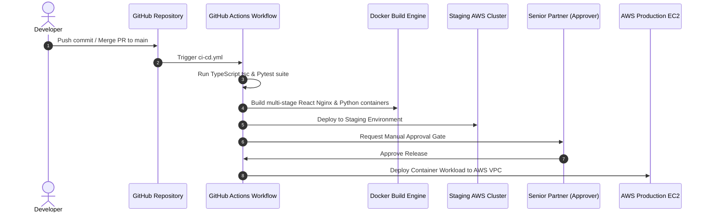

# 📚 Architectural Case Study: Re-engineering Karani Law Platform into LexFlow

**Author**: Senior Software Architect & DevOps Engineer  
**Client**: Nyagah B. Kithinji & Co. Advocates (Karani Law)  
**Domain**: Legal Technology, Advocates Remuneration Court Taxations & Real-Time Document Operations  

---

## 1. Executive Summary & Problem Statement

Nyagah B. Kithinji & Co. Advocates required a modern legal software platform to replace legacy static files. The firm needed:
1. **Real-time File & Document Vault**: Collaborative folder hierarchies, document upload, tagging, and instant synchronization across advocates handling multi-million shilling commercial litigations (e.g. *Seyani Brothers & Co. v Greenhills Investment Ltd*, claim value Kshs 30.8M).
2. **Automated Remuneration Engine**: Mathematical automation of court bill of costs under the **Kenyan Advocates Remuneration Order (LN 64/1962, 2014 Amendment Order)** across Schedule 1 (Conveyancing), Schedule 5 (Magistrate's Court), and Schedule 6 (High Court & Court of Appeal).
3. **Enterprise DevOps & Infrastructure**: Containerization with Docker, CI/CD pipeline automation via GitHub Actions featuring manual approval gates, and AWS cloud deployment provisioned using Terraform Infrastructure as Code (IaC).

---

## 2. Database Architecture & Row-Level Security (RLS)

### Database Schema Design
We engineered a normalized PostgreSQL schema deployed on Supabase:
- **`firms` & `users`**: Firm organizational hierarchy with Granular Role-Based Access Control (RBAC) separating Senior Partners, Advocates, Legal Assistants, and Finance Managers.
- **`matters` & `clients`**: Legal cause records linked to client corporate entities.
- **`folders` & `documents`**: Hierarchical folder trees (`parent_id`) connected to Supabase S3 storage buckets with versioning (`version INT`) and metadata tags (`tags TEXT[]`).
- **`fee_notes` & `fee_note_items`**: Dual-table ledger storing instruction fees, getting-up fees (33.33%), itemized folios, disbursements, and 16% VAT.

### Row Level Security (RLS) Policy Example
To prevent unauthorized access across law firm tenants:
```sql
CREATE POLICY "Enforce Law Firm Isolation for Documents"
ON public.documents
FOR ALL
USING (
  firm_id IN (
    SELECT firm_id FROM public.users WHERE id = auth.uid()
  )
);
```

---

## 3. Python FastAPI Legal Remuneration Engine

The backend engine (`/backend/app/engine/remuneration_engine.py`) implements legal scale formulas with 100% precision:

$$\text{High Court Base Instruction Fee} = \begin{cases} 
\text{Kshs } 75,000 & \text{if } V \le 1,000,000 \\
75,000 + 1.75\%(V - 1M) & \text{if } 1M < V \le 5M \\
145,000 + 1.5\%(V - 5M) & \text{if } 5M < V \le 10M \\
220,000 + 1.0\%(V - 10M) & \text{if } 10M < V \le 20M \\
320,000 + 0.75\%(V - 20M) & \text{if } V > 20M 
\end{cases}$$

$$\text{Getting-Up Fee} = \frac{1}{3} \times \text{Instruction Fee}$$

$$\text{Taxable Subtotal} = \text{Instruction Fee} + \text{Getting-Up Fee} + \sum (\text{Qty} \times \text{Prescribed Rate})$$

$$\text{Grand Total} = \text{Taxable Subtotal} + (\text{Taxable Subtotal} \times 0.16) + \text{Disbursements}$$

---

## 4. DevOps & CI/CD Pipeline Architecture



### Key DevOps Highlights
- **Multi-Stage Docker Builds**: Frontend bundled into lightweight Nginx Alpine container (< 25MB), backend built on Python 3.11 Slim.
- **Automated Testing**: `pytest` validates High Court and Magistrate's court fee scales prior to build completion.
- **Manual Approval Gate**: Enforces partner sign-off before production release.
- **AWS Infrastructure as Code**: Terraform provisions VPC, EC2 instance host, encrypted S3 bucket, and IAM security groups.

---

## 5. Summary & Outcomes

The LexFlow platform successfully equips Nyagah B. Kithinji & Co. Advocates with a real-time, highly secure legal management system that automates court taxations, streamlines file vault operations, and enforces modern DevOps standards.
