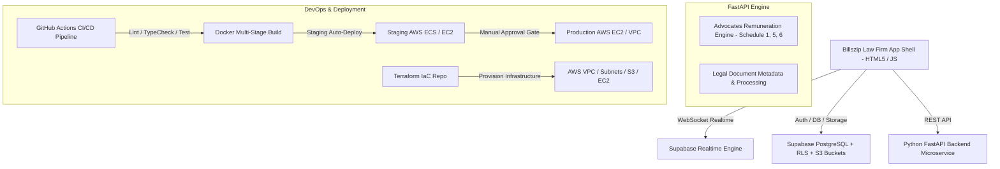

# ⚖️ Billszip — Real-Time Advocates Legal Management Platform
> **Nyagah B. Kithinji & Co. Advocates (Karani Law)**
> Production-grade, real-time legal operations platform built on **Billszip (HTML5/JS App Shell), Python 3.11 FastAPI Backend, Supabase (PostgreSQL + Realtime + Storage), Docker Containerization, GitHub Actions CI/CD, and AWS Terraform IaC**.

---

## 🚀 Key Platform Capabilities

1. **Billszip Real-Time Legal Vault (`/Billszip/excel-vault.html`)**:
   - Encrypted document storage linked to **Supabase S3 Storage**.
   - Drag-and-drop file upload, version control (`v1.0`, `v2.0`), tag filtering (`#taxation`, `#high_court`, `#pleading`), and instant real-time synchronization.

2. **Kenyan Advocates Remuneration Engine (`/backend/app/engine/remuneration_engine.py`)**:
   - Automated legal bill calculation under **Kenya Law LN 64/1962 (2014 Amendment Order)**.
   - **Schedule 6 (High Court, Court of Appeal, ELC, ELRC)** ad valorem scale calculations.
   - **Schedule 5 (Magistrate's Court)** legal instruction fees.
   - **Getting-Up Fees** (33.33% / 1/3 of instruction fee floor).
   - Itemized folio work (Drawings @ Kshs 500/folio, Copying @ Kshs 50/folio, Court Attendances @ Kshs 2,500/hr, Demand Letters @ Kshs 500) + 16% VAT computation.

3. **Billszip Matters & Litigation Pipeline (`/Billszip/matters.html`)**:
   - Law firm case pipeline tracking active litigations, claim values (`Kshs 49M+`), and court taxation stages (*Seyani Brothers v Greenhills*, *Dhanya v Sunil Shah*).

4. **Billszip Remuneration Builder (`/Billszip/bill-of-costs-builder.html`)**:
   - Interactive Advocates Remuneration Order bill builder connected to the Python FastAPI backend service with fallback to client-side JS engine (`/Billszip/remuneration.js`).

---

## 🛠️ Architecture Overview



| Component | Location | Description |
| :--- | :--- | :--- |
| **Billszip Frontend App** | `c:\Users\guyoh\Desktop\Karani Law\Billszip\` | Main HTML5/CSS3/JS Law Firm SPA |
| **Python Backend Service** | `c:\Users\guyoh\Desktop\Karani Law\backend\` | FastAPI Legal Fee Engine & Pytest Suite |
| **Database Schema** | `c:\Users\guyoh\Desktop\Karani Law\supabase\` | PostgreSQL RLS Migration (`00001_initial_schema.sql`) |
| **Docker Compose** | `c:\Users\guyoh\Desktop\Karani Law\docker-compose.yml` | Multi-container launcher (Billszip + FastAPI) |
| **CI/CD Workflows** | `c:\Users\guyoh\Desktop\Karani Law\.github\workflows\` | GitHub Actions (`ci-cd.yml`, `terraform.yml`) |
| **AWS Terraform IaC** | `c:\Users\guyoh\Desktop\Karani Law\terraform\` | Infrastructure configuration for AWS VPC/EC2/S3 |

---

## ⚡ How to Run

### Option 1: Running directly with Python & Web Server (No Docker)
1. Launch Python FastAPI backend:
   ```powershell
   cd "c:\Users\guyoh\Desktop\Karani Law\backend"
   pip install -r requirements.txt
   python -m uvicorn app.main:app --reload --port 8000
   ```
2. Open `Billszip/home.html` or `Billszip/index.html` in your web browser.

### Option 2: Running with Docker Compose
```bash
docker-compose up --build -d
```
- **Billszip Web App**: http://localhost:3000
- **FastAPI API Swagger Docs**: http://localhost:8000/docs
